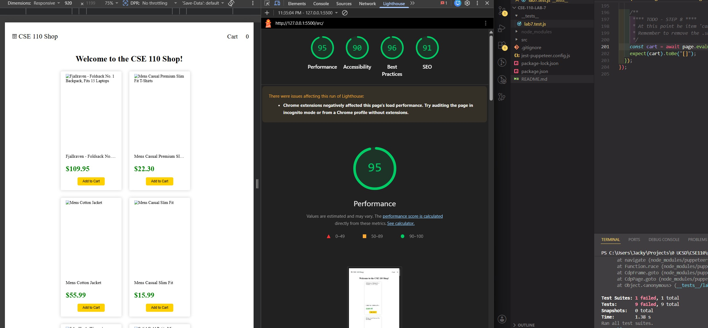

# CSE 110 Lab 7

### Names : Jacky Yu

1. Where would you fit your automated tests in your Recipe project development pipeline? Select one of the following and explain why.

**within a GitHub Action that runs whenever code is pushed**
This is the best option because it automatically checks whether new changes break existing functionality before the code is merged or used by other team members. It also makes testing consistent, since everyone’s code is tested the same way instead of relying on each person to remember to run tests locally.

2. Would you use an end to end test to check if a function is returning the correct output? (yes/no)

**No.** End-to-end tests are meant to test a full user workflow from start to finish, such as clicking buttons, interacting with the webpage, and checking that the UI behaves correctly. To check whether a single function returns the correct output, I would use a unit test instead.

3. What is the difference between navigation and snapshot mode?

Navigation mode analyzes a page immediately after it loads, so it is useful for measuring overall page load performance. Snapshot mode analyzes the page in its current state, so it is better for checking things like accessibility issues at a specific moment, but it does not analyze JavaScript performance or changes to the DOM over time.

4. Name three things we could do to improve the CSE 110 shop site based on the Lighthouse results.
   1. Add better accessibility labels, such as alt text for images and clear labels for interactive elements.
   2. Improve performance by reducing unused JavaScript or CSS and optimizing page resources.
   3. Improve best practices and SEO by using proper metadata, semantic HTML, and making sure the page structure is clear for browsers and search engines.
